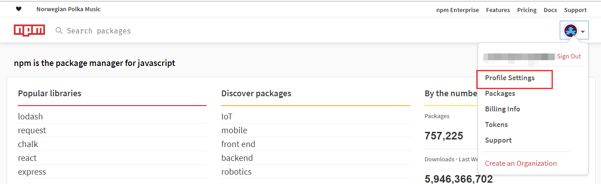
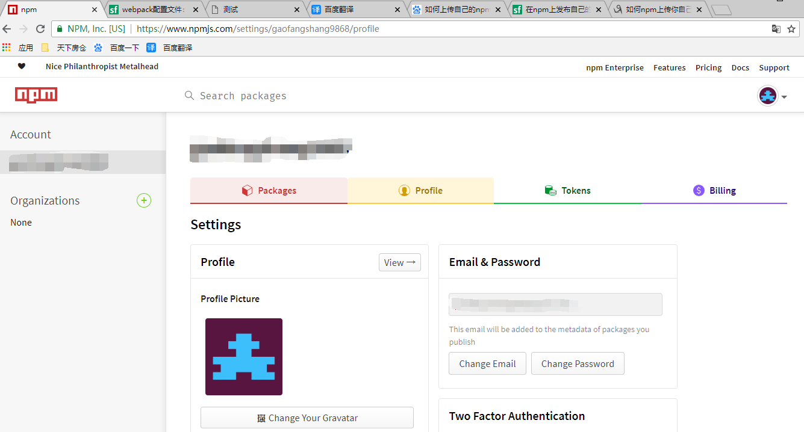
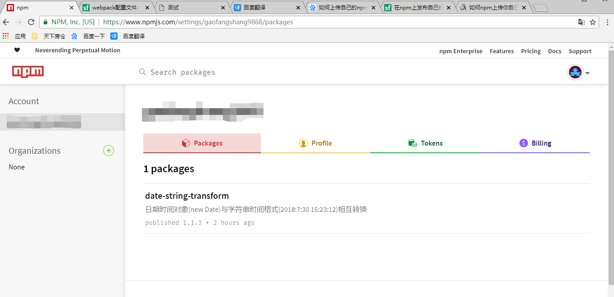

记录一下插件包的完整上传流程

1,如何上传自己的npm插件包
----
账号申请：申请一个自己的npm账号。[传送门~](https://www.npmjs.com/signup)     

npm路径还原：还原npm下载路径`npm config set registry http://registry.npmjs.org `   
     
创建package.json：`mkdir npm-demo` ; `npm init`，一路回车到底.

修改package.json信息：  

      {
        "name": "npm-test111",  //包名
        "version": "0.0.1",      //版本号
      }
   
npm登陆：`npm login`；输入用户名、密码和邮箱

放入需要发布的包，并在package.json中做出修改：

    比如在package.json的同级目录下放入index.js，并准备发布index.js文件包。
    
    {
       "name": "npm-test111",  //包名
       "version": "0.0.1",      //版本号
       "main": "index.js",
     }

发包：`npm publish`

验证：[登陆npm](https://www.npmjs.com/login)---Profile Settings--package     
正常发包后能在这里看到自己成功发布的包；

验证包已经成功发布，但是npm一直下载失败的话，可能是网络原因         
    ---- 可以等待几分钟，换cnpm下载。     
    
*cnpm淘宝镜像会每隔10分钟同步一次npm包，不需要等待多久。*

2,版本更新
-----
修改版本号： 

    npm version 1.1.0       // 直接指定新版本的版本号
    npm version patch       // 小版本号默认加1
    
 当然你也可以在package.json中直接修改
 
 发包： `npm publish`

3，注意事项
----
如果你想发布一个优质的资源包，那么这些基本操作很有必要：
* 压缩合并去除注释
* es6转码es5
* 尽量上传模块化导出版本(默认)和script标签直接导出版本，方便使用者自己选择。

