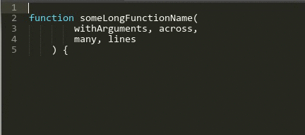
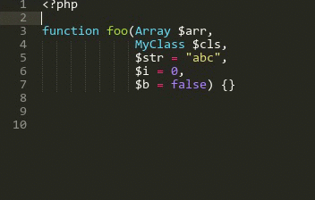
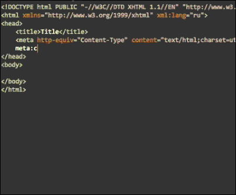

sublime text3初始化配置
====

1,如何安装插件
----
* Ctrl+Shift+P调出命令面板 
* 输入install 调出 Install Package 选项并回车		
	 如果直接出现package列表，则可开始下一步；		
     若原有的列表 消失，则重复上述操作，列表即可出现。
* 接下来输入需要的插件名称，然后选择即可安装~

2,常用插件
----
•HTML-CSS-JS Prettify		
全能序列化

•CSS Format		
css序列化插件，支持默认多种序列方案，还可以自己配置自己喜欢的

•JsFormat		
js序列化，能排在下载插件前25位，好的话就不用说了

•DocBlockr				
DocBlocker 是在Sublime平台上开发一款自动补全注释插件，支持JavaScript (including ES6), PHP, ActionScript, Haxe, CoffeeScript, TypeScript, Java, Apex, Groovy, Objective C, C, C++ and Rust.等众多语言

•Emmet		
Emmet的前身是大名鼎鼎的Zen coding，如果你从事Web前端开发的话，对该插件一定不会陌生。它使用仿CSS选择器的语法来生成代码，大大提高了HTML/CSS代码编写的速度

•JavaScript Completions		
js最基本的api快查片段

3,vue相关插件
----
•Vue Syntax Highlight		
Vue高亮插件，它不仅可以使代码高亮起来，还能进行代码智能提示。

5,markdown相关插件
----
•Markdown Editing
Markdown Editing并不只是一个markdown的主题插件		
它自定义许多markdown的快捷键,例如ctrl+2是二级标题,还有许多可以看配置文件和项目的[github主页](https://github.com/SublimeText-Markdown/MarkdownEditing)		
推荐配置

		"color_scheme": "Packages/Boxy Theme/schemes/Boxy Monokai.tmTheme", // 修改风格的主题,我这里是sublime的boxy主题自带的,默认有这几种主题 
        //"color_scheme": "Packages/MarkdownEditing/MarkdownEditor.tmTheme", 
        // "color_scheme": "Packages/MarkdownEditing/MarkdownEditor-Dark.tmTheme",
        // "color_scheme": "Packages/MarkdownEditing/MarkdownEditor-Yellow.tmTheme", 
        "highlight_line": true, // 高亮正在编辑的行 
        "line_numbers": true, // 显示行号 
        "tab_size": 4, // tab宽度 
        "translate_tabs_to_spaces": true, // tab转换为空格 
        "trim_trailing_white_space_on_save": true, // 保存时去掉行尾空格 
        "word_wrap": true, // 自动换行 
        "wrap_width": "auto", // 换行的宽度,默认80会造成左侧大量留白 
        "mde.keep_centered": true, // 可以保持你正在编辑的行始终处于屏幕的中间

•MarkdownLivePreview		
MarkdownLivePreview可以实现实时预览		
在首选项->Package Setting里修改MarkdownLivePreview的user配置文件,设置在打开时同步预览

	"markdown_live_preview_on_open": true

4,热键冲突
----
ctrl+\`  ---- sublime呼出控制台的快捷键，与*搜狗浏览器*的老板键：ctrl+~ 冲突

