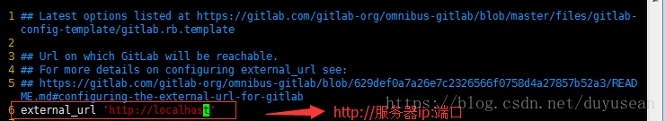
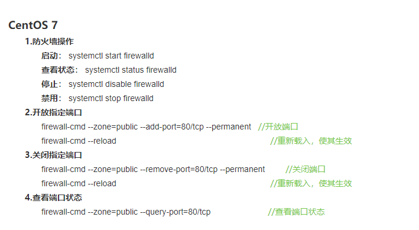

之前有在自己的服务器上搭建一个git仓库，但是又觉得其功能太单一，所以想搭建一个gitlab，网上查查找找终于弄好了。

下面贴上自己的搭建步奏，以供参考：

一、 安装并配置必要的依赖关系
----

1，安装ssh

    sudo yum install -y curl policycoreutils-pythonopenssh-server

2.将SSH服务设置成开机自启动，

    sudo systemctl enable sshd

3.启动SSH服务

    sudo systemctl start sshd

4.安装防火墙（如果已经安装了防火墙并且已经在运行状态，则可直接进行第6步）

    yum install firewalld systemd -y

5.开启防火墙

    service firewalld  start

6.添加http服务到firewalld,pemmanent表示永久生效，若不加--permanent系统下次启动后就会失效。

    sudo firewall-cmd --permanent --add-service=http

7.重启防火墙

    sudo systemctl reload firewalld

8.接下来，安装Postfix以发送通知邮件

    sudo yum install postfix

9.将postfix服务设置成开机自启动

    sudo systemctl enable postfix

10.启动postfix

    sudo systemctl start postfix

11.wget 用于从外网上下载插件

使用命令`wget -v`检查系统中是否已经安装wget.
若wget未安装则进行安装

    yum -y install wget

12.安装vim编辑器

    yum install vim -y

二、添加GitLab镜像源并安装gitlab服务器
----
1.添加gitlab镜像

    wget https://mirrors.tuna.tsinghua.edu.cn/gitlab-ce/yum/el7/gitlab-ce-10.0.0-ce.0.el7.x86_64.rpm

在此时突然遇到了报错：

    error: Failed dependencies:
            policycoreutils-python is needed by gitlab-ce-10.7.3-ce.0.el7.x86_64

先安装policycoreutils-python就可以添加gitlab镜像了

    yum install policycoreutils-python

2.安装gitlab

    rpm -i gitlab-ce-10.0.0-ce.0.el7.x86_64.rpm

3.修改gitlab配置文件指定服务器ip和自定义端口：

    vim  /etc/gitlab/gitlab.rb

进入编辑器后按“i”键进入编辑状态，ESC键退出编辑状态

退出并保存，命令输入“:wq”

**PS**:由于我是希望个人服务器的主页默认80端口是页面，决定将gitlab端口设定为8000。所以这里修改为'http://xxx.xxx.xxx.xxx:8000',
修改端口后需要在防火墙设置开放相应端口权限。

下面是centos7防火墙的几个简单操作：

注意，这里最好写你的服务器IP地址，如果写localhost，固然可以成功，但是在gitlab上创建项目的时候，会很尴尬的出现 '.git/xxx/xx/localhost/...'这样的仓库链接。

4.重置并启动GitLab

    gitlab-ctl reconfigure

    gitlab-ctl restart

5.访问 GitLab页面

    初始账户: root 密码:5iveL!fe

    第一次登录需要修改密码

三，关于安装过程中遇到的问题
----
1、在CentOS里面安装软件,提示软件已安装，但是rpm -q和-e都是提示包没有安装

* 查看与rpm包相关的文件和其他信息   rpm -qa | grep 包名
* 查询包是否被安装，命令：rpm -q 包名
* 删除软件包，命令：rpm -e 包名

运行以上三步，把原来的包删除掉重新下载和安装

2，502问题

可能是权限问题：

    解决方法：chmod -R 755 /var/log/gitlab

找不到的原因的话，也可能是内存问题：

    安装使用GitLab需要至少4GB可用内存(RAM + Swap)! 由于操作系统和其他正在运行的应用也会使用内存,
    所以安装GitLab前一定要注意当前服务器至少有4GB的可用内存. 少于4GB内存会出现各种诡异的问题, 而且在使用过程中也经常会出现500错误.

四，gitlab卸载
-----
买的服务器太小了，一直502，蓝瘦香菇，决定还是老老实实用原来的git仓库好了。

1、停止gitlab

    gitlab-ctl stop

2、卸载gitlab（注意这里写的是gitlab-ce）

    rpm -e gitlab-ce

3、查看gitlab进程

    ps aux | grep gitlab

4、杀掉第一个进程（就是带有好多.............的进程）

    kill -9 18777  // 18777就是第一行，root后面紧跟着的那个数字

杀掉后，在ps aux | grep gitlab确认一遍，还有没有gitlab的进程

5、删除所有包含gitlab文件

    find / -name gitlab | xargs rm -rf

参考文章
----
[Centos 7搭建Gitlab服务器超详细](https://blog.csdn.net/duyusean/article/details/80011540)

[Centos下GitLab安装，遇坑填坑，修改默认端口，解决502错误](https://blog.csdn.net/jacka654321/article/details/80629824)

[CentOS 6、CentOS7 防火墙开放指定端口](https://blog.csdn.net/jiang_2992/article/details/79725032)

[完全卸载删除gitlab](https://yq.aliyun.com/articles/114619)